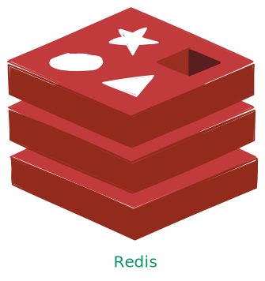

## 概述

Redis 是一款开源的键值对数据库，核心优势在于**基于内存存储**和**丰富的数据结构支持**，这让它拥有微秒级的读写响应速度，成为高性能系统中的常用工具。它不仅能存储基础的字符串数据，还支持哈希、列表、集合、有序集合等多种结构，可灵活应对不同业务场景，比如用哈希存储用户信息、用有序集合实现排行榜。同时，Redis 具备数据持久化能力，通过 RDB（快照）和 AOF（日志）两种方式，能将内存中的数据定期或实时写入磁盘，避免意外断电导致的数据丢失。

在实际应用中，Redis 的用途非常广泛。作为缓存时，它能放在数据库前方，暂存高频访问的数据，大幅减少数据库的查询压力；作为计数器时，依托其原子操作特性，可精准实现点赞数、阅读量、接口调用次数等实时统计功能；在分布式系统中，它还能通过 `SETNX` 等命令实现分布式锁，保证多节点操作的数据一致性；此外，基于列表的 `LPUSH` 和 `BRPOP` 命令，也能快速搭建简单的消息队列，处理异步任务。

