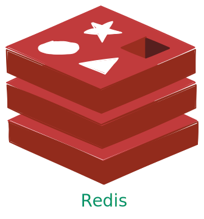

## 概述

  

Redis 是一款开源的键值对数据库，核心优势在于**基于内存存储**和**丰富的数据结构支持**，这让它拥有微秒级的读写响应速度，成为高性能系统中的常用工具。它不仅能存储基础的字符串数据，还支持哈希、列表、集合、有序集合等多种结构，可用作**数据库**、**缓存**和**消息代理**，比如用哈希存储用户信息、用有序集合实现排行榜。同时，Redis 具备数据持久化能力，通过 RDB（快照）和 AOF（日志）两种方式，能将内存中的数据定期或实时写入磁盘，避免意外断电导致的数据丢失。

在实际应用中，Redis 的用途非常广泛。作为缓存时，它能放在数据库前方，暂存高频访问的数据，大幅减少数据库的查询压力；作为计数器时，依托其原子操作特性，可精准实现点赞数、阅读量、接口调用次数等实时统计功能；在分布式系统中，它还能通过 `SETNX` 等命令实现分布式锁，保证多节点操作的数据一致性；此外，基于列表的 `LPUSH` 和 `BRPOP` 命令，也能快速搭建简单的消息队列，处理异步任务。

## 项目来源与改进

本项目基于《Build Your Own Redis with C/C++》一书进行实践与扩展：

- 原书主页：https://build-your-own.org/redis/

在原有教学示例的基础上，做了以下改动与计划：

- 使用更现代的 C++ 语法与实践，提升可读性与可维护性；
- 调整代码结构：将公共接口与类型声明放在 `include/`，实现细节放在 `src/`，做到头文件与实现文件分离；
- 在核心代码（如网络通信、数据结构实现）中补充大量详细注释，清晰说明关键逻辑与设计思路，降低后续维护与二次开发的理解成本；
- 未来将加入测试代码与基准测试，便于验证正确性与评估性能；
- 未来将绘制项目整体架构图，直观展示核心模块（如协议解析、数据存储）的划分与数据流向，辅助理解系统设计。

致谢：原书与相关资源的版权归其作者所有，本仓库仅用于学习与交流用途。

